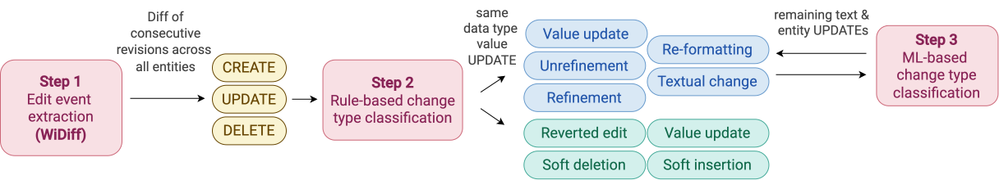

# WiDiff - Change Classification

This README presents steps to reproduce change type classfication and is structured as follows:
- [Change classification](#change-classification): 
  - [Change classification framework and change type taxonomy](#change-classification-framework-and-change-type-taxonomy): Describes the change classification framework and change type taxonomy
  - [Rule-based classification](#rule-based-classification): describes how rule-based classification is performed.
  - [ML model training](#ml-model-training): describes how to re-train models if needed and provides links to trained models.
  - [LLM baseline](#llm-baseline): describes how to run the LLM baseline
  - [Classification of remaining changes (Text and Entity)](#classification-of-remaining-changes-text-and-entity): describes how to classify remaining changes (those that weren't classified by rule-based classifiers).
- [Analysis](#descriptive-analysis): instructions on how to re-run the analysis.
- [Downloading extra data](#downloading-extra-data): explaines how to download extra data (e.g., transitive closures).
- [Transitive Closure Cache Creation](#transitive-closure-cache-creation): instructions on how to create the transitive closure cache from the .csv files obtained in [Downloading extra data](#downloading-extra-data).

**NOTE:** For change extraction, please read the main README *wikidata-edit-history/README.md*.

**To reproduce the comparison of RDF and Relational DB storage go to *wikidata-edit-history/rdf_benchmarking/README.md*.**

# Change Classification Framework and Change Type taxonomy

This section presents our change classification framework and change type taxonmy.

As shown in the picture below, our change classification framework is composed of 3 steps. The first step classifies edit events which are the basic edits a user can perform on Wikidata entities. In particular, this step classifies (1) statement (and associated rank) insertion, update and deletion, (2) qualifier insertion and deletion, and (3) reference insertion and deletion.
In Step 2 we re-interpret some edit events (e.g., the upgrade of a rank can be classified as soft insertion), tag reverted edits (reverted edits within 4 weeks) and value updates between values of different datatypes (e.g., quantity to string) or from "no value" or "some value" to a concrete value.
Moreover, in this step we classify UPDATE edit events between values of the same data type into *refinement*, *unrefinement*, *re-formatting*, *textual change* and *value update*, using rule-based classifiers.

In Step 3, we classify UPDATE edit events between values of type string-string and entity-entity into refinement, unrefinement, textual change, or value update, using an ML classifier.



Next, we present the definitions of the different change types.

## Change Type Taxonomy

In the following we present the definitions of change types in our taxonomy.

### Statement Addition
A new statement is added to an entity. *Example:* for the entity Uruguay (Q77) the statement <Uruguay, capital, Montevideo>[↗](https://www.wikidata.org/w/index.php?title=Q77&diff=next&oldid=5443901) was added.

### Reference/Qualifier Addition
A reference or qualifier is added to an existing statement. *Example:* The qualifier {end time: 2014} was added to <Luis Suárez, member of sports team, Liverpool F.C.>[↗](https://www.wikidata.org/w/index.php?title=Q26517&diff=prev&oldid=318347070), and the reference {imported from Wikimedia project: Italian Wikipedia} was added to <Luis Suárez, mass, 85>[↗](https://www.wikidata.org/w/index.php?title=Q26517&diff=prev&oldid=355943840).

### Soft Insertion
A statement's rank is changed from *normal* or *deprecated* to *preferred*, indicating that it represents the most current or accurate value among multiple statements for the same property.
*Example:* <Luis Suárez, given name, Luis> rank was promoted to *preferred*[↗](https://www.wikidata.org/w/index.php?title=Q26517&diff=prev&oldid=889792976), when a second statement <Luis Suárez, given name, Alberto> was added for the same property[↗](https://www.wikidata.org/w/index.php?title=Q26517&diff=next&oldid=889792976).

### Statement Deletion
A statement is permanently removed from an entity.
*Example:* <Frank van Pamelen, image, Lezing Frank van Pamelen over De Vliegende Hollander.webm>[↗](https://www.wikidata.org/w/index.php?title=Q21281434&diff=next&oldid=1328934396) was deleted after the correct statement (using the *video* property) was added in the prior revision[↗](https://www.wikidata.org/w/index.php?title=Q21281434&diff=prev&oldid=1328934396).

### Reference/Qualifier Deletion
A reference or qualifier is removed from an existing statement. *Example:* The reference {imported from Wikimedia project: Italian Wikipedia} was removed from <Luis Suárez, mass, 85>[↗](https://www.wikidata.org/w/index.php?title=Q26517&diff=prev&oldid=759983195) and replaced by a more precise one. Similarly, the qualifier {end time: 2020} was removed from <Luis Suárez, member of sports team, Futbol Club Barcelona> and replaced by {end time: September 2020}[↗](https://www.wikidata.org/w/index.php?title=Q26517&diff=prev&oldid=1282785821).

### Soft Deletion
A statement is logically invalidated without being removed, either by setting its rank to *deprecated* or by adding an *end time (P582)* qualifier (in practice, we also consider the properties *earliest end date (P8554)*, *latest end date (P12506)*, and *end period (P3416)*).

**Examples:**
- <X, native label, Twitter> was deprecated [↗](https://www.wikidata.org/w/index.php?title=Q918&diff=next&oldid=1941896530) in favour of <X, native label, X>[↗](https://www.wikidata.org/w/index.php?title=Q918&diff=prev&oldid=1941896530)
- {end time: July 2023} was added to <X, official name, Twitter>[↗](https://www.wikidata.org/w/index.php?title=Q918&diff=prev&oldid=1942019219) to mark the renaming of the social network.

### Value Update
A property value is replaced with a semantically different value, altering the statement's meaning. For time, quantity, and globecoordinate values, we also consider sign changes (e.g., -1 -> +1(https://www.wikidata.org/w/index.php?title=Q801294&diff=prev&oldid=110422583)) as value updates, since switching the sign alters the meaning of the value. 
**Examples:**
- *Entity:* Agnosticism (Q288928) -> Islam (Q432)[↗](https://www.wikidata.org/w/index.php?title=334871&diff=prev&oldid=1035395644)
- *Text:* "a country in North America" -> "a country in Central America"[↗](https://www.wikidata.org/w/index.php?title=242&diff=prev&oldid=3747808)
- *Quantity:* +1684527 -> +1719070[↗](https://www.wikidata.org/w/index.php?title=254232&diff=prev&oldid=1028093806) or -1 -> +1 [↗](https://www.wikidata.org/w/index.php?title=Q801294&diff=prev&oldid=110422583)
- *Globe coordinate:* {"latitude": -3.09771, "longitude": -226.98051}{"latitude": -2.8114, "longitude": 118.169}[↗](https://www.wikidata.org/w/index.php?title=26727&diff=prev&oldid=135136435).
- *Time:* -5-00-00 -> +1951-09-25[↗](https://www.wikidata.org/w/index.php?title=210447&diff=prev&oldid=1070077246) or +100-00-00 -> -100-00-00[↗](https://www.wikidata.org/w/index.php?title=Q801294&diff=prev&oldid=663123864), +1764-01-01 -> +1764-00-00[↗](https://www.wikidata.org/w/index.php?title=Q801294&diff=prev&oldid=1574340120)

### Re-formatting
A property value’s representation is modified at the surface-level, without altering its underlying meaning. For numeric values, re-formatting covers changes in numerical precision that do not alter the value (e.g., adding or removing trailing zeros). Furthermore, globecoordinate values can only be entered in Wikidata in decimal-degree format (e.g., 38.585), as the interface does not support other representations, such as degree-minute-second. As a result, re-formatting changes, which would arise from converting between these formats, do not occur. Additionally, we observed that time values were altered
by adding spaces or special characters, without changing the actual value. We classified these changes as re-formatting.
**Examples:**
- *Quantity:* +4.0 -> +4[↗](https://www.wikidata.org/w/index.php?title=Q801294&diff=prev&oldid=109984021) or +98 -> +98.0[↗](https://www.wikidata.org/w/index.php?title=Q801294&diff=prev&oldid=107182680)

### Textual Change
A property value of type text is modified to correct or introduce language errors, such as spelling, typos, or grammar, without altering sentence structure or the statement's meaning. This also covers surface-level presentation changes, such as spacing, capitalization, hyphenation, punctuation, and other typographical elements. 
**Examples:**
- "country in southeastern Europe" -> "Country in Southeast Europe"[↗](https://www.wikidata.org/w/index.php?title=Q225&diff=prev&oldid=1678150592)
- "American acterss" -> "American actress"[↗](https://www.wikidata.org/w/index.php?title=Q801294&diff=prev&oldid=143695424)
- "German neuroloigst" -> "German neurologist"[↗](https://www.wikidata.org/w/index.php?title=61670\&diff=prev\&oldid=1294776951)
- "country in southeastern Europe" -> "Country in Southeast Europe"[↗](https://www.wikidata.org/w/index.php?title=Q225\&diff=prev\&oldid=1678150592)
- "Province of Lecce" -> "Pprovince of Lecce"[↗](https://www.wikidata.org/w/index.php?title=16197\&diff=prev\&oldid=2026395311)
- "sovereignt" -> "sovereignty"[↗](https://www.wikidata.org/w/index.php?title=42008&diff=prev&oldid=1288335214)
- "A mountain in Beijing" -> "mountain in Beijing"[↗](https://www.wikidata.org/w/index.php?title=111218927&diff=prev&oldid=2306840798)

### Refinement / Unrefinement
A property value is replaced by a more (refinement) or less (unrefinement) precise value, without changing the statement's meaning. A refinement may add contextual information, rephrase a text to convey the same meaning more clearly, increase numerical precision, or provide a more specific classification. Analogously, an unrefinement may remove contextual information, decrease numerical precision, or generalize to a broader classification. In both cases, the new value remains semantically compatible with the old one.
**Examples:**
- *Entity:* business (Q4830453) <-> automobile manufacturer (Q786820)[↗](https://www.wikidata.org/w/index.php?title=257815&diff=prev&oldid=1316485355)
- *Text:* "city" <-> "city in South Korea"[↗](https://www.wikidata.org/w/index.php?title=42131&diff=prev&oldid=369720776)
- *Quantity:* +222 <-> +222.4[↗](https://www.wikidata.org/w/index.php?title=192789&diff=prev&oldid=986978112)
- *Globe coordinate:* {"latitude": 14, "longitude": 121.917} <-> {"latitude": 14, "longitude": 121.91666666667} [↗](https://www.wikidata.org/w/index.php?title=103807&diff=prev&oldid=89413888)
- *Time:* +1910-02-10 <-> +1910-00-00[↗](https://www.wikidata.org/w/index.php?title=Q3895839&diff=prev&oldid=1431694434)

### Reverted Edit
A change is considered reverted when a subsequent edit restores a previous value of a property.
*Example:* "44th President of the United States of America" -> "Worst president ever" for Barack Obama (Q76) [↗](https://www.wikidata.org/w/index.php?title=Q76&diff=prev&oldid=7375872) was reverted in a subsequent revision.

---

## Rule-based classification

Rule-based classification is performed during change extraction by setting *re-interpretation: true* in the *set_up.yml* file for change extraction (See *Change Extraction* section in *wikidata-edit-history/README.md*).

Rule-based classifiers can be found in *wikidata-edit-history/classifiers/rule/rule_based_classifier.py*.

Rule-based samples manually checked by a human annotator can be found at [Wikidata Labeled Changes (Manually and Rule-Based)](https://doi.org/10.5281/zenodo.22657989).

---

## Classification of remaining changes (Text and Entity)

We provide an example for the *classifier_setup.yml* in *classifier_setup.example.yml*. Make a copy of this file and configure it accordingly.

**Before running the classification, perform the following steps:**
1. Rename the table *updates_text{suffix}* to *updates_text{suffix}_full*
2. Create the following 2 tables:
```
  create table updates_text{suffix}_non_latin as
  select *
  from updates_text{suffix}_full
  where old_value->>0 ~ '[^\u0000-\u036F\u1E00-\u1EFF\u2000-\u206F\u2070-\u218F]' OR
  new_value->>0 ~ '[^\u0000-\u036F\u1E00-\u1EFF\u2000-\u206F\u2070-\u218F]';

  create table updates_text{suffix} as
  select *
  from updates_text{suffix}_full
  where not (old_value->>0 ~ '[^\u0000-\u036F\u1E00-\u1EFF\u2000-\u206F\u2070-\u218F]' OR
  new_value->>0 ~ '[^\u0000-\u036F\u1E00-\u1EFF\u2000-\u206F\u2070-\u218F]');
```
3. Run the update of labels and descriptions for entity. 

**NOTE:** We provide a dump of the table entity_stats_all (download *entity_stats_all.tar* from [Wikidata Change Classification: ML models, features, transitive closures (October 2025), and data for plots](https://doi.org/10.5281/zenodo.22205544) and restore the dump onto the database). However, this table is automatically generated in the script from the entity_stats, entity_stats_sa, entity_stats_ao and entity_stats_less tables. If you performed a **new extraction with a new dump**, you can just run the script and the update will be performed with all entities' labels and descriptions. If using the provided data (from the dump of June 2025) and the filtered dataset (no _less, _sa, or _ao partitions), download *entity_stats_all.tar* and upload it to the database with the name *entity_stats_all*.

To run the labels and descriptions updates run `python3 -m extract_remaining_changes` with the following parameters in the *classifier_setup.yml*

```
classification_ml:
  classify: false     <--------
  evaluate: false     <--------
  table_suffix: ''     <--- set this according to the specific table suffix (e.g., '', '_less', '_sa', '_ao')
  train: false         <--------
config:
  classifier_type: ml     <--------
  db_config_path: config/aux_db_config.json
update_entity_labels_descriptions: true    <--------
```

4. Rename the table *updates_entity{suffix}* to *updates_entity{suffix}_full*
5. Create the following 2 tables:
```
  create table updates_entity{suffix}_non_latin as
  select *
  from updates_entity{suffix}_full
  where (old_value_label = '' OR old_value_label IS NULL) OR
            (new_value_label = '' OR new_value_label IS NULL) OR
            old_value_label ~ '[^\u0000-\u036F\u1E00-\u1EFF\u2000-\u206F\u2070-\u218F]' OR
            new_value_label ~ '[^\u0000-\u036F\u1E00-\u1EFF\u2000-\u206F\u2070-\u218F]';

  create table updates_entity{suffix} as
  select *
  from updates_entity{suffix}_full
  where not ((old_value_label = '' OR old_value_label IS NULL) OR
            (new_value_label = '' OR new_value_label IS NULL) OR
            old_value_label ~ '[^\u0000-\u036F\u1E00-\u1EFF\u2000-\u206F\u2070-\u218F]' OR
            new_value_label ~ '[^\u0000-\u036F\u1E00-\u1EFF\u2000-\u206F\u2070-\u218F]');
```

**NOTE:** The previous steps separate changes containing non-latin characters into their own table (with suffix _latin).

1. Download Transitive closure cache from [Wikidata Change Classification: ML models, features, transitive closures (October 2025), and data for plots](https://doi.org/10.5281/zenodo.22205544) and store it in *auxiliary_data/s*. If not, create a new one following the steps in [Downloading extra data](#downloading-extra-data) and [Transitive Closure Cache Creation](#transitive-closure-cache-creation)
2. Download the trained ML classifiers from [Wikidata Change Classification: ML models, features, transitive closures (October 2025), and data for plots](https://doi.org/10.5281/zenodo.22205544) and put both *training_info* and *features* folder under *classifiers/ml/*.
3. Set the following parameters in *wikidata-edit-history/classifier_setup.yml*:
````
  config:
    db_config_path: path_to_db_with_changes  <-----
    classifier_type: ml   <-----
  classification_ml:
    train: false          <-----
    classify: true        <-----
    evaluate: false       <-----
    table_suffix: ''      <----- change for the corresponding table suffix (See Database schema and change extraction filters)
  update_entity_labels_descriptions: false  <-----
````

**NOTE:** db_config_path is the path to the database that stores the changes. The config.json has the same structure as the one set for change extraction, can use that one as is.

4. Run:

```bash
python3 -m classify_remaining_changes
```

this command classifies entity changes using rule-based first, and then classifies the remaining entity and text changes using the trained ML model.

---

## ML model training

The trained ML models and features can be found in [Wikidata Change Classification: ML models, features, transitive closures (October 2025), and data for plots](https://doi.org/10.5281/zenodo.22205544).

The training dataset can be found at [Wikidata Labeled Changes (Manually and Rule-Based)](https://doi.org/10.5281/zenodo.22657989).

We provide an example configuration file in *classifiers/ml/config/ml_classifier_config.example.json*.
Configure its path in *classifier_setup.yml* under *config -> ml_config_path* accordingly.

**Configuration**

Training is performed doing 5-fold cross validation with a 3-fold cross validation for Grid Search per outer fold. The number of folds (5) can be changed in *classifiers/ml/config/ml_classifier_config.json*

Additionally, since we want to guarantee that every change has a label assigned and multi-label classifiers return probabilities for each class, we assign all labels to a change where prob >= 0.5, If no probability reaches this threshold, we take the one with the maximum probability. This threshold can be modified in *classifiers/ml/config/ml_classifier_config.json*.

Finally, we use *random_state = 42* so results are reproducible (also set in *classifiers/ml/config/ml_classifier_config.json*).

**Output**

Training outputs *training_info_<model_name>.pkl* files with the following structure:

`````bash
    {
        "datatype": {
            'results_folds': [], # results per fold
            'micro_averages': {
                'datatype': {
                    'precision': float,
                    'recall': float,
                    'accuracy': float,
                    'f1': float
                }
            } 
    }

    # results per fold:
    {
        'classifier': string, # kn, xgboost, random_forest, gradient_boosting
        'fold': int, # 0-4
        'scaler': sklearn_scaler_for_fold,
        'metrics_results': { # macro average
            'label': { 
                'precision': float,
                'recall': float,
                'accuracy': float,
                'f1': float
            }
        },
        'model': clf, # if the base_model doesn't support MultiOutput classification, we send it through MultiOutputClassifier. If not base_model == model
        'base_model': model, # base model (GradientBoosting, RandomForest, XGBoost, KNN)
        'features': feature_cols, 
        'label_binarizer': label_binarizer,
        'best_params': best_params_from_grid_search
    }
`````

**Re-training**

1. To re-train models, set the following parameters in *wikidata-edit-history/classifier_setup.yml*:
  ```
    config:
      classifier_type: ml
    classification_ml:
      train: true
      classify: false
      evaluate: true
  ```

**Inter annotator agreement**
The shared samples labeled by 2 other extra annotators and compute of IAA can be found in *wikidata-edit-history/classifiers/ml/training_dataset/shared_overlap*. The notebook *inter_annotator_agreement* calculates the IAA.

---

## LLM baseline
1. Configure LLM in *classifiers/llm/config/llm_classifier_config.json*. To use Qwen 3.5 (FP8 quantized), run the script *classifiers/llm/qwen_server.sh* in the background and set the corresponding `base_url` in the configuration file (*classifiers/llm/config/llm_classifier_config.json*). 
2. Set `classifier_type: llm` and `llm_config_path` under *config* in  *wikidata-edit-history/classifier_setup.yml*. 
3. Run `python3 -m classifiy_remaining_changes`. This classifies changes on the labeled dataset (*classifiers/ml/training_dataset*). To modify the changes to label, set the `[classification_llm][path_to_entity_changes]` and `[classification_llm][path_to_text_changes]` in  *wikidata-edit-history/classifier_setup.yml* to other files.

*Note:* We used 2 40GB VRAM GPUs and that's why `--tensor-parallel-size 2` is used in *classifiers/llm/qwen_server.sh*. If running on a single GPU, then this should be removed

---

# Analysis
All analysis *.sql* scripts can be found in *wikidata-edit-history/analysis/sql*.

- To replicate plots, download *data_for_plots.zip* from [Wikidata Change Classification: ML models, features, transitive closures (October 2025), and data for plots](https://doi.org/10.5281/zenodo.22205544) and put the *data/* folder under *wikidata-edit-history/analysis/scripts*. Then run the script `python3 plots.py`, which generates plots in *wikidata-edit-history/analysis/scripts/results*
- All *.sql* queries ran for same data type UPDATEs analysis section can be found at *wikidata-edit-history/analysis/sql/using_change_types.sql*

---

# Downloading extra data

All files needed for this step are in the folder `/wdtk` of this repository.

## Prerequisites

- Java 17+ (tested with OpenJDK 17.0.14)
- Maven 3.9+ (tested with Apache Maven 3.9.12)

## Overview

We use the [Wikidata Toolkit](https://github.com/Wikidata-Toolkit/Wikidata-Toolkit) to extract additional data from a Wikidata JSON dump.

We provide the extracted data in [Wikidata Change Classification: ML models, features, transitive closures (October 2025), and data for plots](https://doi.org/10.5281/zenodo.22205544). To extract new data, follow the steps below.

Three extraction classes are provided:

| Class | Description |
|---|---|
| `ExtractTransitiveClosure` | Extracts transitive closures for `subclass of`, `has part(s)`, `part of`, and `located in` |

## Output Files

**`ExtractTransitiveClosure`** (up to 10 hops, columns: `entity_id`, `entity_id_numeric`, `transitive_closure_qids`, `transitive_closure_numeric_ids`)
- `subclass_of_transitive.csv` — transitive closure of `subclass of (P279)`
- `part_of_transitive.csv` — transitive closure of `part of (P361)`
- `has_parts_transitive.csv` — transitive closure of `has part(s) (P527)`
- `located_in_transitive.csv` — transitive closure of `located in (P131)`

## Setup and Execution
**1. Clone the Wikidata Toolkit**
```bash
git clone https://github.com/Wikidata-Toolkit/Wikidata-Toolkit
```

**2. Download a Wikidata dump**

Download a `latest-all.json.bz2` dump and place it in:
```
Wikidata-Toolkit/dumpfiles/wikidatawiki/json-YYYYMMdd/
```
where `YYYYMMdd` is the dump date. The toolkit expects this exact folder structure and a `.json.bz2` format.

Example: *Wikidata-Toolkit/dumpfiles/wikidatawiki/json-20252018/wikidata-20251018-all.json.bz2*

**3. Add the extraction files**

Copy `ExtractTransitiveClosure.java`, and `config.properties` from `wdtk/` into:
```
Wikidata-Toolkit/wdtk-examples/src/main/java/org/wikidata/wdtk/examples/
```

**4. Replace the `pom.xml` files**

Copy the provided `pom.xml` files into the Wikidata Toolkit directory, replacing the existing ones:

- `wdtk/pom.xml` → `Wikidata-Toolkit/pom.xml`
- `wdtk/wdtk-examples-pom.xml` → `Wikidata-Toolkit/wdtk-examples/pom.xml`

**Note:** Before running a different extraction class, update the `<mainClass>` field in `Wikidata-Toolkit/wdtk-examples/pom.xml`:
```xml
<mainClass>org.wikidata.wdtk.examples.CLASS_NAME</mainClass>
```

**5. Enable offline mode** *(skip if you want the toolkit to download the dump itself)*

In `Wikidata-Toolkit/wdtk-examples/src/main/java/org/wikidata/wdtk/ExampleHelpers.java`, change:
```java
public static final boolean OFFLINE_MODE = false;
```
to:
```java
public static final boolean OFFLINE_MODE = true;
```

**6. Configure `config.properties`**

Copy `config.properties` file to `Wikidata-Toolkit` root.

| Parameter | Description |
|---|---|
| `dump_path` | Path to the `.json.bz2` dump file |
| `output_dir` | Path to the directory where output files will be stored |
| `language` | Language code for labels, descriptions, and aliases (e.g., `en`) |


**7. Configure and run the bash script**

Set the following parameters in `extract_extra_data.bash`:

| Parameter | Description |
|---|---|
| `WORK_DIR` | Path to the cloned Wikidata Toolkit directory |
| `JAR_FILE` | Path to the built JAR (default: `$WORK_DIR/wdtk-examples/target/wdtk-examples-0.17.1-SNAPSHOT.jar`) |
| `MAX_HEAP` | Maximum JVM heap size (e.g., `140G`) |
| `INIT_HEAP` | Initial JVM heap size (e.g., `140G`) |
| `GC_THREADS` | Number of parallel GC threads |
| `CONCURRENT_GC_THREADS` | Number of concurrent GC threads |

Then run:
```bash
bash extract_extra_data.bash
```

---

# Transitive Closure Cache Creation
**NOTE:** We provide the transitive closure cache in *transitive_closures.zip* from [Wikidata Change Classification: ML models, features, transitive closures (October 2025), and data for plots](https://doi.org/10.5281/zenodo.22205544).

The transitive closure cache is required for rule-based change classification. It loads the transitive closure CSV files produced by `ExtractTransitiveClosure.java` into memory and serializes them as a pickle file for fast access during feature computation.

**Set the following parameters in `classifier_setup.yml` under `transitive_closure_cache`:**
- *subclass_transitive_path:* path to the .csv file with the transitive closures for subclass of
- *part_of_transitive_path:* path to the .csv file with the transitive closures for part of
- *has_part_transitive_path:* path to the .csv file with the transitive closures for has parts
- *located_in_transitive_path:* path to the .csv file with the transitive closures for located in
- *transitive_closure_pickle_file_path:* file path to the transitive closure cache pickle file
- *transitive_closure_stats_pickle_file_path:* file path to transitive closure cache stats pickle file (size, time of construction)

To create the cache, run:

```bash
from classifiers.rule.transitive_closure_cache import TransitiveClosureCache
cache = TransitiveClosureCache()
```

**Note:** Cache creation is slow and memory-intensive (the full cache can reach several GB). It only needs to be run once — subsequent runs load directly from the pickle file.
